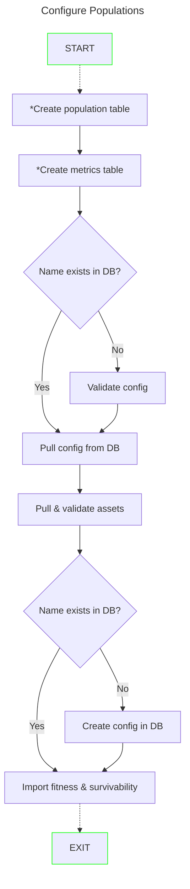

# egp-population

```mermaid
---
title: Configure Populations
---
flowchart TB
    s[START]
    b1[*Create population table]
    b2[*Create metrics table]
    b3{Name exists in DB?}
    b4[Validate config]
    b5[Pull config from DB]
    b6[Pull & validate assets]
    b7{Name exists in DB?}
    b8[Create config in DB]
    b9[Import fitness & survivability]
    e[EXIT]
    s:::ses -.-> b1 --> b2 --> b3 -- Yes --> b5 --> b6 --> b7 -- Yes --> b9 -.->e:::ses
    b3 -- No --> b4 --> b5
    b7 -- No --> b8 --> b9
classDef ses stroke:#0f0
```
